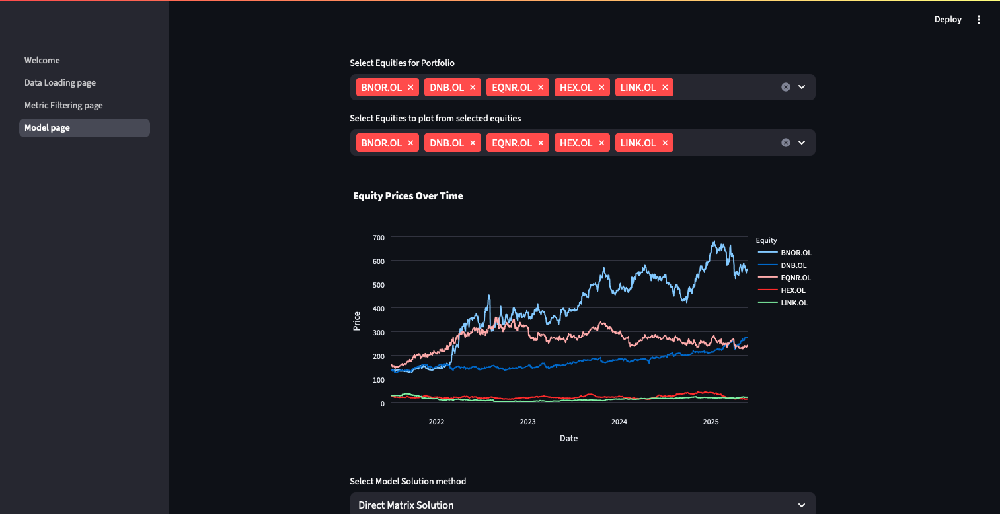

# Portfolio Optimisation Project

Hello! Welcome to my Portfolio optimisation project. Currently only works for Oslo Stock Exchange but more european exchanges will be added.
Consists for three primary pages:
    1. Data Loading Page: Loads in data from selected marketes given desired time period
    2. Metric filtering: From the market data, for every stock extract fundamental metrics such as PE, PB, Current Ratio and display with a couple of histograms
    3. Model Page: Select the equities desired to be placed in your final portfolio. Then select the Portfolio optimisation model.

## TODO:
- [ ] Allow for multiple markets, not just OSBX
- [ ] Will need ability to convert everything to a single currency if working across multiple currencies
- [ ] Add page to select stocks to compare, earnings growth, PE etc. as well make some super basic model to compare earnings?
- [ ] Currently load in entire market to select before doing anything else - better to first select stocks you wish to load in
- [ ] Following from point above - Data Loading page will need to be changed and so will the metric filtering page (or just a seperate page that is distinct from the two)
- [ ] Optimisation of Sharpe ratios instead of mean-variance 

